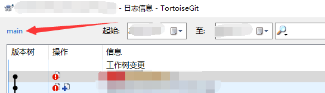
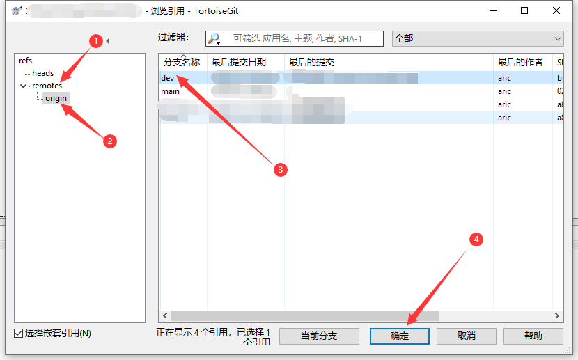
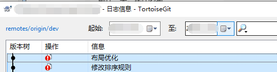
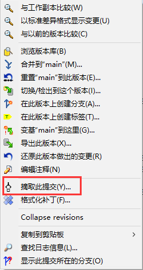
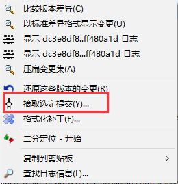
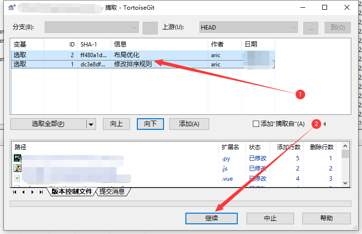

# 合并指定commit到指定分支

例：将dev分支的某些commit合并到main分支中

## 使用命令行

> 命令行方式为网上转载，未进行测试

git branch -a

git checkout dev

git log 查看历史commit提交，复制需要合并的commit id 如：c758b7401a8bd6ba5a4b19a4f47c0c7bfd31b7aa

git checkout main 

(重要)git cherry-pick c758b7401a8bd6ba5a4b19a4f47c0c7bfd31b7aa

git push

## 使用TortoiseGit（小乌龟）

1.将dev分支的这些commit push到远程

2.切换分支到main上，并同步一下远程的记录

3.项目中右键，点击 显示日志（Show log），并在左上角处将分支切换为dev

4.选中我们需要合并到main分支的那些commit，并右键，点击 摘取此提交（Cherry Pick this commit）

选取多个时，点击 摘取选定提交

5.在弹出的界面中，选中需要pick的commit，点击继续（Continue）。

6.此时这些commit已经合并到本地的main分支上了，可以项目中右键，点击 显示日志（Show log）进行查看。如果有冲突就解决一下。

7.推送到远程（push）